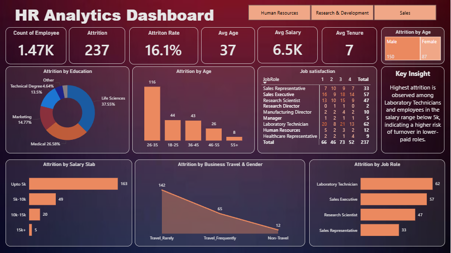
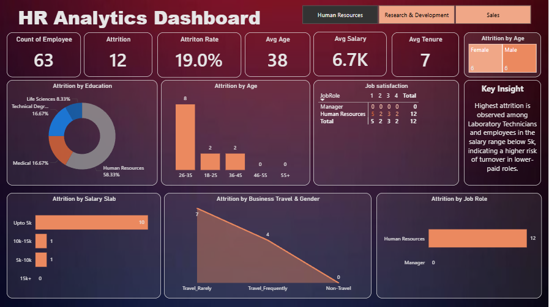
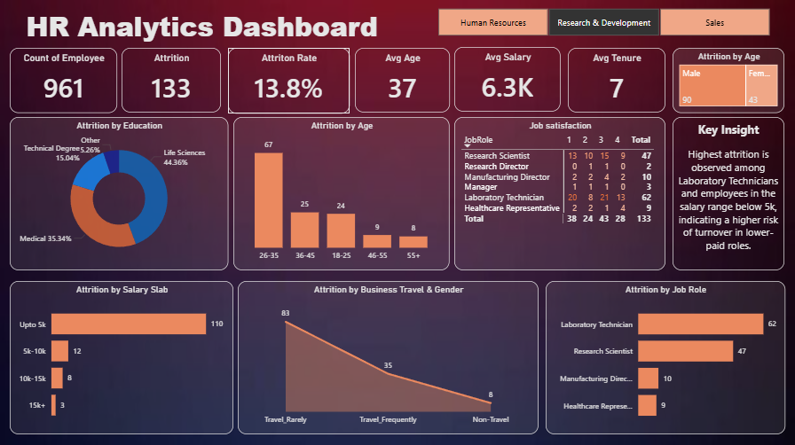
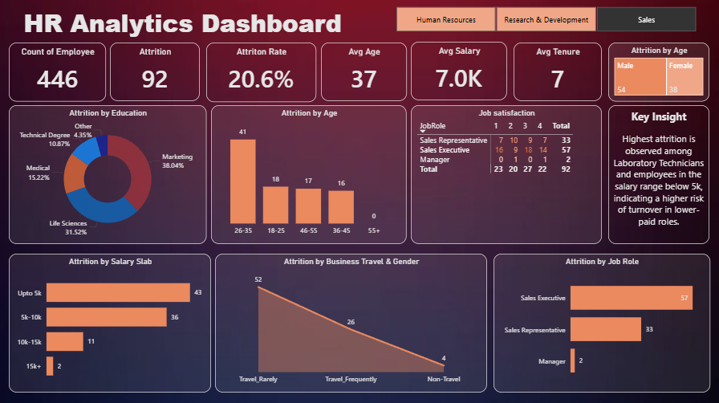

#  HR Analytics Dashboard (Power BI)

## Project Overview
This project presents an **interactive HR Analytics Dashboard** built using **Power BI**.  
The dashboard provides insights into employee data, focusing on **attrition trends, demographics, salary distribution, and job roles**.

It is designed to help HR teams identify patterns behind employee turnover and support better decision-making.

## Key Features

### KPI Cards (Top Section)
The dashboard highlights important HR metrics:
- Total Employees
- Attrition Count
- Attrition Rate (%)
- Average Age
- Average Salary
- Average Tenure

These KPIs dynamically update based on selected filters.

## Visual Insights

### Attrition by Education
Shows which education fields have higher employee attrition.

### Attrition by Age
Displays age groups with the highest turnover.

### Job Satisfaction Table
Breaks down satisfaction levels across job roles.

### Attrition by Salary Slab
Highlights attrition trends across different salary ranges.

### Attrition by Business Travel
Shows how travel frequency impacts employee turnover.

### Attrition by Job Role
Identifies roles with the highest attrition.

### Attrition by Gender
Provides comparison between male and female attrition.

## Key Insight
A dedicated section summarizes major findings:
- Higher attrition observed in specific job roles
- Employees in lower salary ranges show higher turnover risk

## Slicers (Filters)

The dashboard includes interactive slicers for:
- Human Resources
- Research & Development
- Sales

### How Slicers Work
- Selecting a department updates all KPIs and visuals
- Enables department-wise analysis
- Helps compare trends across different business units

## Dashboard Previews

### Overall Dashboard

### Human Resources View

### Research & Development View

### Sales view

##  Tools & Technologies
- Power BI  
- Data Modeling  
- DAX (Data Analysis Expressions)

## How to Use
1. Download the `.pbix` file  
2. Open it in Power BI Desktop  
3. Use slicers to explore different departments  
4. Interact with visuals for insights  

## Key Learnings
- Data cleaning and transformation  
- Creating KPI measures using DAX  
- Designing interactive dashboards  
- Building user-friendly and interactive reports  

---
